# [📈 Live Status](https://status.enlivendesigners.com): <!--live status--> **🟧 Partial outage**

This repository contains the open-source uptime monitor and status page for [enlivenonedrive](https://status.enlivendesigners.com), powered by [Upptime](https://github.com/upptime/upptime).

With [Upptime](https://upptime.js.org), you can get your own unlimited and free uptime monitor and status page, powered entirely by a GitHub repository. We use [Issues](https://github.com/enlivenonedrive/upptime/issues) as incident reports, [Actions](https://github.com/enlivenonedrive/upptime/actions) as uptime monitors, and [Pages](https://status.enlivendesigners.com) for the status page.

<!--start: status pages-->
<!-- This summary is generated by Upptime (https://github.com/upptime/upptime) -->
<!-- Do not edit this manually, your changes will be overwritten -->
<!-- prettier-ignore -->
| URL | Status | History | Response Time | Uptime |
| --- | ------ | ------- | ------------- | ------ |
|  [Aarohisilk](https://aarohisilks.com) | 🟩 Up | [aarohisilk.yml](https://github.com/enlivenonedrive/upptime/commits/HEAD/history/aarohisilk.yml) | 

 171ms
     
 | 

<a href="https://status.enlivendesigners.com/history/aarohisilk">100.00%</a>
    

|  [Airtopup](https://airtopup.com) | 🟩 Up | [airtopup.yml](https://github.com/enlivenonedrive/upptime/commits/HEAD/history/airtopup.yml) | 

 584ms
     
 | 

<a href="https://status.enlivendesigners.com/history/airtopup">100.00%</a>
    

|  [Amazetrading](https://amazetrading.ca) | 🟩 Up | [amazetrading.yml](https://github.com/enlivenonedrive/upptime/commits/HEAD/history/amazetrading.yml) | 

 535ms
     
 | 

<a href="https://status.enlivendesigners.com/history/amazetrading">91.16%</a>
    

|  [Arkanfood](https://raknfoods.com) | 🟩 Up | [arkanfood.yml](https://github.com/enlivenonedrive/upptime/commits/HEAD/history/arkanfood.yml) | 

 720ms
     
 | 

<a href="https://status.enlivendesigners.com/history/arkanfood">77.13%</a>
    

|  [Ceylononlineshop](https://ceylononlineshop.com) | 🟩 Up | [ceylononlineshop.yml](https://github.com/enlivenonedrive/upptime/commits/HEAD/history/ceylononlineshop.yml) | 

 701ms
     
 | 

<a href="https://status.enlivendesigners.com/history/ceylononlineshop">91.20%</a>
    

|  [Cocomileceylon](https://cocomillceylon.com) | 🟩 Up | [cocomileceylon.yml](https://github.com/enlivenonedrive/upptime/commits/HEAD/history/cocomileceylon.yml) | 

 822ms
     
 | 

<a href="https://status.enlivendesigners.com/history/cocomileceylon">79.62%</a>
    

|  [Contractpoints](https://contractpoints.com) | 🟩 Up | [contractpoints.yml](https://github.com/enlivenonedrive/upptime/commits/HEAD/history/contractpoints.yml) | 

 640ms
     
 | 

<a href="https://status.enlivendesigners.com/history/contractpoints">91.23%</a>
    

|  [Dipuravana](https://dipuravana.com) | 🟩 Up | [dipuravana.yml](https://github.com/enlivenonedrive/upptime/commits/HEAD/history/dipuravana.yml) | 

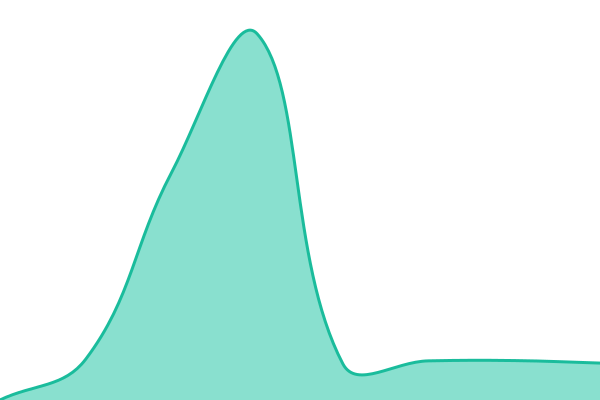 522ms
     
 | 

<a href="https://status.enlivendesigners.com/history/dipuravana">77.20%</a>
    

|  [Dipuravanarentals](https://dipuravanarentals.com) | 🟩 Up | [dipuravanarentals.yml](https://github.com/enlivenonedrive/upptime/commits/HEAD/history/dipuravanarentals.yml) | 

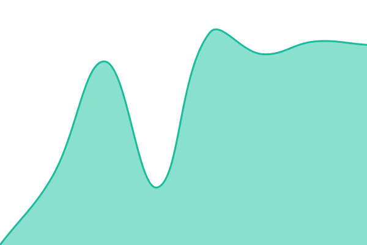 700ms
     
 | 

<a href="https://status.enlivendesigners.com/history/dipuravanarentals">91.27%</a>
    

|  [Dynamicspize](https://dynamicspize.com) | 🟩 Up | [dynamicspize.yml](https://github.com/enlivenonedrive/upptime/commits/HEAD/history/dynamicspize.yml) | 

 637ms
     
 | 

<a href="https://status.enlivendesigners.com/history/dynamicspize">77.24%</a>
    

|  [Econtips](https://econtips.com) | 🟩 Up | [econtips.yml](https://github.com/enlivenonedrive/upptime/commits/HEAD/history/econtips.yml) | 

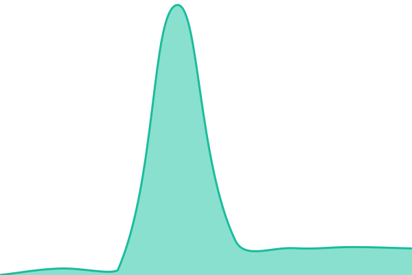 706ms
     
 | 

<a href="https://status.enlivendesigners.com/history/econtips">91.31%</a>
    

|  [Ecuniversity](https://ecuniversity.online) | 🟩 Up | [ecuniversity.yml](https://github.com/enlivenonedrive/upptime/commits/HEAD/history/ecuniversity.yml) | 

 178ms
     
 | 

<a href="https://status.enlivendesigners.com/history/ecuniversity">93.68%</a>
    

|  [Enliven Designers](https://enlivendesigners.com) | 🟩 Up | [enliven-designers.yml](https://github.com/enlivenonedrive/upptime/commits/HEAD/history/enliven-designers.yml) | 

 234ms
     
 | 

<a href="https://status.enlivendesigners.com/history/enliven-designers">100.00%</a>
    

|  [Evershinecoaches](https://evershinecoaches.co.uk) | 🟩 Up | [evershinecoaches.yml](https://github.com/enlivenonedrive/upptime/commits/HEAD/history/evershinecoaches.yml) | 

 707ms
     
 | 

<a href="https://status.enlivendesigners.com/history/evershinecoaches">77.42%</a>
    

|  [Fnilogistics](http://fnilogistics.com) | 🟩 Up | [fnilogistics.yml](https://github.com/enlivenonedrive/upptime/commits/HEAD/history/fnilogistics.yml) | 

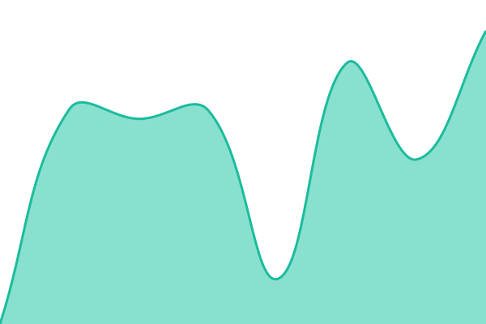 1489ms
     
 | 

<a href="https://status.enlivendesigners.com/history/fnilogistics">91.49%</a>
    

|  [Gsmwholesaler](https://gsmwholesaler.com) | 🟥 Down | [gsmwholesaler.yml](https://github.com/enlivenonedrive/upptime/commits/HEAD/history/gsmwholesaler.yml) | 

 0ms
     
 | 

<a href="https://status.enlivendesigners.com/history/gsmwholesaler">0.00%</a>
    

|  [Jesuranwellness](https://jesuranwellness.com.au/) | 🟩 Up | [jesuranwellness.yml](https://github.com/enlivenonedrive/upptime/commits/HEAD/history/jesuranwellness.yml) | 

 654ms
     
 | 

<a href="https://status.enlivendesigners.com/history/jesuranwellness">77.46%</a>
    

|  [Notionblend](https://notionblend.com) | 🟩 Up | [notionblend.yml](https://github.com/enlivenonedrive/upptime/commits/HEAD/history/notionblend.yml) | 

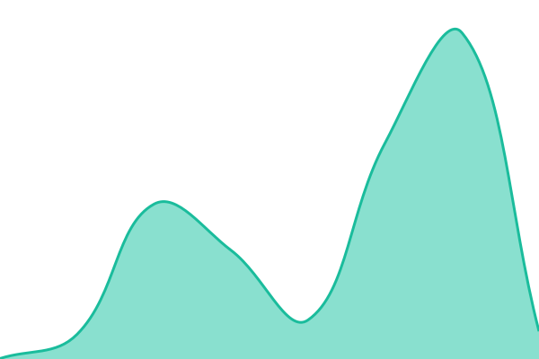 266ms
     
 | 

<a href="https://status.enlivendesigners.com/history/notionblend">100.00%</a>
    

|  [Owkuniversity](https://owkuniversity.online) | 🟩 Up | [owkuniversity.yml](https://github.com/enlivenonedrive/upptime/commits/HEAD/history/owkuniversity.yml) | 

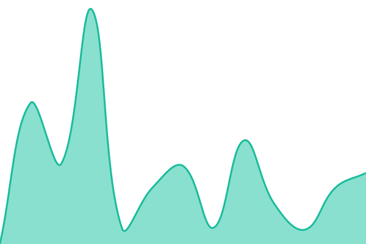 205ms
     
 | 

<a href="https://status.enlivendesigners.com/history/owkuniversity">93.98%</a>
    

|  [Primeserviceglobal](https://primeservicesglobal.co.uk) | 🟩 Up | [primeserviceglobal.yml](https://github.com/enlivenonedrive/upptime/commits/HEAD/history/primeserviceglobal.yml) | 

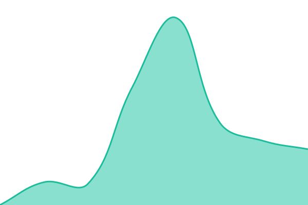 712ms
     
 | 

<a href="https://status.enlivendesigners.com/history/primeserviceglobal">93.08%</a>
    

|  [Primeteaceylon](https://primeteaceylon.com) | 🟩 Up | [primeteaceylon.yml](https://github.com/enlivenonedrive/upptime/commits/HEAD/history/primeteaceylon.yml) | 

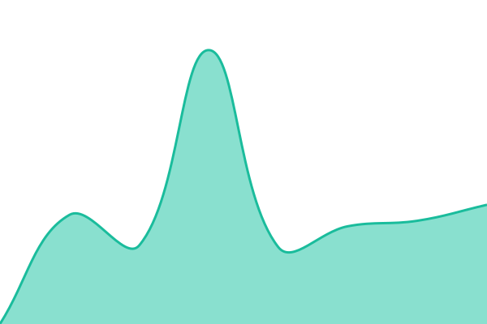 852ms
     
 | 

<a href="https://status.enlivendesigners.com/history/primeteaceylon">77.64%</a>
    

|  [Rbpesolutions](https://rbpesolutions.co.uk) | 🟩 Up | [rbpesolutions.yml](https://github.com/enlivenonedrive/upptime/commits/HEAD/history/rbpesolutions.yml) | 

 722ms
     
 | 

<a href="https://status.enlivendesigners.com/history/rbpesolutions">91.71%</a>
    

|  [Rmylogistics](https://rmylogistics.com) | 🟩 Up | [rmylogistics.yml](https://github.com/enlivenonedrive/upptime/commits/HEAD/history/rmylogistics.yml) | 

 709ms
     
 | 

<a href="https://status.enlivendesigners.com/history/rmylogistics">77.68%</a>
    

|  [Seflk](https://seflk.org) | 🟩 Up | [seflk.yml](https://github.com/enlivenonedrive/upptime/commits/HEAD/history/seflk.yml) | 

 851ms
     
 | 

<a href="https://status.enlivendesigners.com/history/seflk">92.22%</a>
    

|  [Startglobal](https://startglobalsl.co.uk) | 🟩 Up | [startglobal.yml](https://github.com/enlivenonedrive/upptime/commits/HEAD/history/startglobal.yml) | 

 742ms
     
 | 

<a href="https://status.enlivendesigners.com/history/startglobal">77.71%</a>
    

|  [Symbiosophy](http://symbiosophy.org) | 🟩 Up | [symbiosophy.yml](https://github.com/enlivenonedrive/upptime/commits/HEAD/history/symbiosophy.yml) | 

 634ms
     
 | 

<a href="https://status.enlivendesigners.com/history/symbiosophy">77.73%</a>
    

|  [Symbioun](https://symbioun.lk) | 🟩 Up | [symbioun.yml](https://github.com/enlivenonedrive/upptime/commits/HEAD/history/symbioun.yml) | 

 809ms
     
 | 

<a href="https://status.enlivendesigners.com/history/symbioun">91.81%</a>
    

|  [Technifyit](https://technifyit.co.uk) | 🟩 Up | [technifyit.yml](https://github.com/enlivenonedrive/upptime/commits/HEAD/history/technifyit.yml) | 

 641ms
     
 | 

<a href="https://status.enlivendesigners.com/history/technifyit">77.77%</a>
    

|  [Tactsolutionslk](https://tactsolutionslk.com/) | 🟩 Up | [tactsolutionslk.yml](https://github.com/enlivenonedrive/upptime/commits/HEAD/history/tactsolutionslk.yml) | 

 703ms
     
 | 

<a href="https://status.enlivendesigners.com/history/tactsolutionslk">91.85%</a>
    

|  [Ukallbl](https://ukallbl.institute) | 🟩 Up | [ukallbl.yml](https://github.com/enlivenonedrive/upptime/commits/HEAD/history/ukallbl.yml) | 

 449ms
     
 | 

<a href="https://status.enlivendesigners.com/history/ukallbl">94.29%</a>
    

|  [Ukcclqv](https://ukcclqv.institute) | 🟩 Up | [ukcclqv.yml](https://github.com/enlivenonedrive/upptime/commits/HEAD/history/ukcclqv.yml) | 

 813ms
     
 | 

<a href="https://status.enlivendesigners.com/history/ukcclqv">77.96%</a>
    

|  [Ukckabl](https://ukckabl.institute) | 🟩 Up | [ukckabl.yml](https://github.com/enlivenonedrive/upptime/commits/HEAD/history/ukckabl.yml) | 

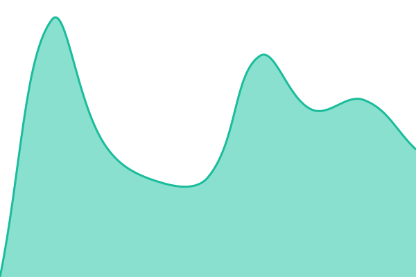 600ms
     
 | 

<a href="https://status.enlivendesigners.com/history/ukckabl">93.40%</a>
    

|  [Unitedxchange](https://unitedxchange.co.uk) | 🟥 Down | [unitedxchange.yml](https://github.com/enlivenonedrive/upptime/commits/HEAD/history/unitedxchange.yml) | 

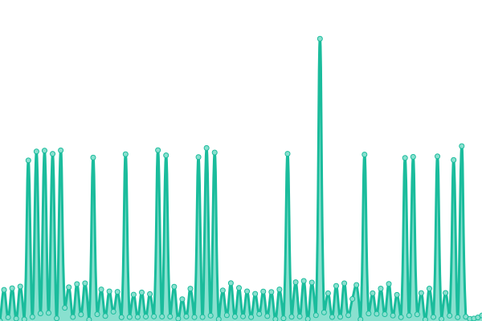 0ms
     
 | 

<a href="https://status.enlivendesigners.com/history/unitedxchange">0.00%</a>
    

|  [Unreachedbrands](https://unreachedbrands.com) | 🟥 Down | [unreachedbrands.yml](https://github.com/enlivenonedrive/upptime/commits/HEAD/history/unreachedbrands.yml) | 

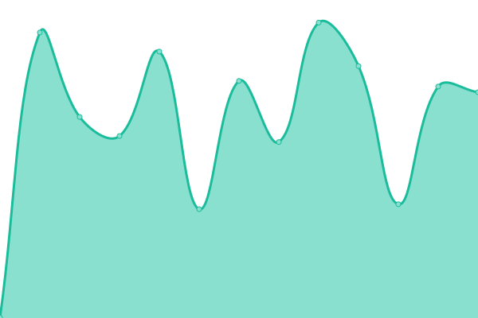 0ms
     
 | 

<a href="https://status.enlivendesigners.com/history/unreachedbrands">0.00%</a>
    

|  [Vialanka Travels](vialankatravels.com) | 🟩 Up | [vialanka-travels.yml](https://github.com/enlivenonedrive/upptime/commits/HEAD/history/vialanka-travels.yml) | 

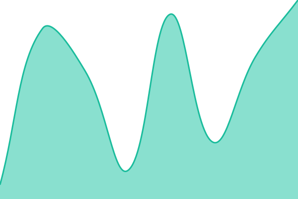 23ms
     
 | 

<a href="https://status.enlivendesigners.com/history/vialanka-travels">100.00%</a>
    

|  [Staging Server](81.0.218.72) | 🟥 Down | [staging-server.yml](https://github.com/enlivenonedrive/upptime/commits/HEAD/history/staging-server.yml) | 

 0ms
     
 | 

<a href="https://status.enlivendesigners.com/history/staging-server">0.00%</a>
    

|  [Production Server 1](194.163.168.18) | 🟩 Up | [production-server-1.yml](https://github.com/enlivenonedrive/upptime/commits/HEAD/history/production-server-1.yml) | 

 128ms
     
 | 

<a href="https://status.enlivendesigners.com/history/production-server-1">100.00%</a>
    

|  [Production Server 3](82.180.145.176) | 🟩 Up | [production-server-3.yml](https://github.com/enlivenonedrive/upptime/commits/HEAD/history/production-server-3.yml) | 

 217ms
     
 | 

<a href="https://status.enlivendesigners.com/history/production-server-3">100.00%</a>
    

<!--end: status pages-->

[**Visit our status website →**](https://status.enlivendesigners.com)

## 📄 License

- Powered by: [Upptime](https://github.com/upptime/upptime)
- Code: [MIT](./LICENSE) © [Anand Chowdhary](https://anandchowdhary.com), supported by [Pabio](https://pabio.com)
- Data in the `./history` directory: [Open Database License](https://opendatacommons.org/licenses/odbl/1-0/)
